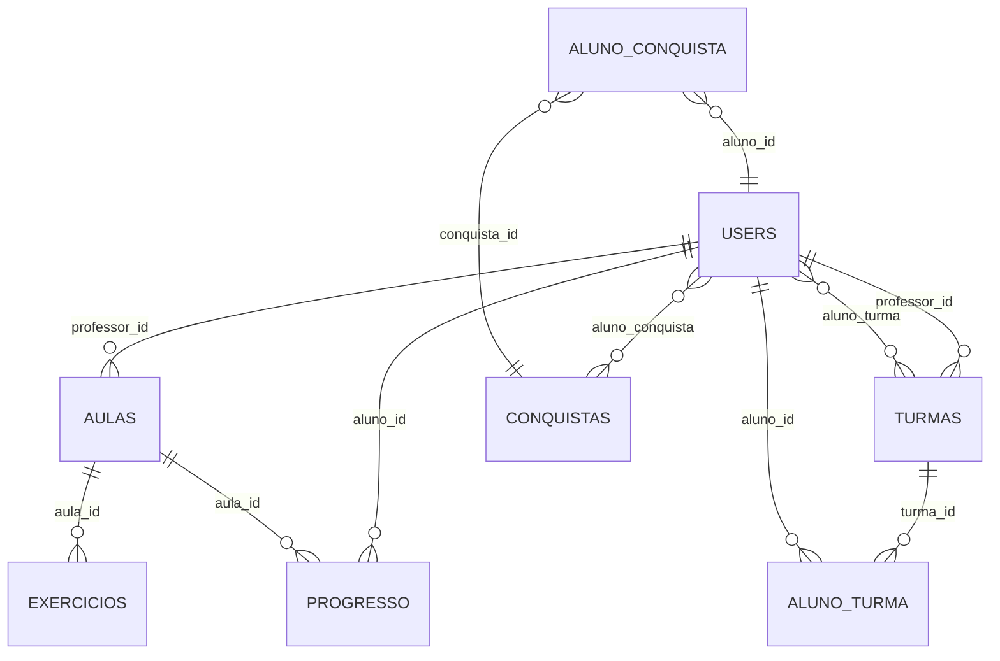

# 🗄️ Estrutura do Banco de Dados - Escola para Todos

## 📋 Visão Geral

Este documento descreve a estrutura completa do banco de dados SQLite da aplicação **Escola para Todos**, incluindo todas as tabelas, relacionamentos e funcionalidades implementadas.

## 🏗️ Arquitetura do Banco

### **Tecnologia**
- **SGBD**: SQLite 3
- **Arquivo**: `escola_para_todos.db`
- **Localização**: Raiz do projeto

### **Características**
- ✅ **Sem dependências externas** (SQLite nativo)
- ✅ **Relacionamentos completos** com FOREIGN KEYs
- ✅ **Constraints de validação** (CHECK, UNIQUE)
- ✅ **Índices otimizados** para performance
- ✅ **Timestamps automáticos** para auditoria
- ✅ **Suporte a JSON** (armazenado como TEXT)

## 📊 Tabelas Principais

### 1. 👥 **USERS** - Sistema de Usuários
```sql
CREATE TABLE users (
    id INTEGER PRIMARY KEY AUTOINCREMENT,
    username TEXT UNIQUE NOT NULL,      -- Login único
    email TEXT UNIQUE NOT NULL,         -- Email único
    password_hash TEXT NOT NULL,        -- Senha criptografada
    first_name TEXT NOT NULL,           -- Nome
    last_name TEXT NOT NULL,            -- Sobrenome
    user_type TEXT NOT NULL,            -- 'aluno', 'professor', 'admin'
    is_active BOOLEAN DEFAULT 1,        -- Status ativo/inativo
    created_at TIMESTAMP DEFAULT CURRENT_TIMESTAMP,
    updated_at TIMESTAMP DEFAULT CURRENT_TIMESTAMP
);
```

**Tipos de Usuário:**
- `aluno`: Estudantes que acessam o conteúdo
- `professor`: Educadores que criam conteúdo
- `admin`: Administradores do sistema

### 2. 🏫 **TURMAS** - Organização Escolar
```sql
CREATE TABLE turmas (
    id INTEGER PRIMARY KEY AUTOINCREMENT,
    nome TEXT NOT NULL,                 -- Nome da turma
    serie TEXT NOT NULL,                -- Série/ano
    professor_id INTEGER NOT NULL,      -- Professor responsável
    created_at TIMESTAMP DEFAULT CURRENT_TIMESTAMP,
    FOREIGN KEY (professor_id) REFERENCES users (id)
);
```

### 3. 📚 **ALUNO_TURMA** - Matrículas
```sql
CREATE TABLE aluno_turma (
    id INTEGER PRIMARY KEY AUTOINCREMENT,
    aluno_id INTEGER NOT NULL,          -- ID do aluno
    turma_id INTEGER NOT NULL,          -- ID da turma
    data_matricula TIMESTAMP DEFAULT CURRENT_TIMESTAMP,
    status TEXT DEFAULT 'ativo',        -- 'ativo', 'inativo', 'transferido'
    FOREIGN KEY (aluno_id) REFERENCES users (id),
    FOREIGN KEY (turma_id) REFERENCES turmas (id),
    UNIQUE(aluno_id, turma_id)         -- Evita duplicatas
);
```

### 4. 📖 **AULAS** - Conteúdo Educacional
```sql
CREATE TABLE aulas (
    id INTEGER PRIMARY KEY AUTOINCREMENT,
    titulo TEXT NOT NULL,               -- Título da aula
    descricao TEXT,                     -- Descrição detalhada
    disciplina TEXT NOT NULL,           -- Matéria
    serie TEXT NOT NULL,                -- Série/ano
    link_video TEXT,                    -- URL do vídeo
    professor_id INTEGER NOT NULL,      -- Professor criador
    duracao_minutos INTEGER DEFAULT 45, -- Duração estimada
    dificuldade TEXT DEFAULT 'medio',   -- 'facil', 'medio', 'dificil'
    created_at TIMESTAMP DEFAULT CURRENT_TIMESTAMP,
    updated_at TIMESTAMP DEFAULT CURRENT_TIMESTAMP,
    FOREIGN KEY (professor_id) REFERENCES users (id)
);
```

### 5. ✏️ **EXERCICIOS** - Avaliações
```sql
CREATE TABLE exercicios (
    id INTEGER PRIMARY KEY AUTOINCREMENT,
    enunciado TEXT NOT NULL,            -- Pergunta/exercício
    alternativas TEXT NOT NULL,         -- JSON das opções
    resposta_correta TEXT NOT NULL,     -- Resposta certa
    aula_id INTEGER NOT NULL,           -- Aula relacionada
    pontos INTEGER DEFAULT 10,          -- Pontuação
    tipo TEXT DEFAULT 'multipla_escolha', -- Tipo de exercício
    created_at TIMESTAMP DEFAULT CURRENT_TIMESTAMP,
    FOREIGN KEY (aula_id) REFERENCES aulas (id)
);
```

**Tipos de Exercício:**
- `multipla_escolha`: Escolha única entre opções
- `verdadeiro_falso`: Verdadeiro ou falso
- `texto`: Resposta textual livre

### 6. 📊 **PROGRESSO** - Acompanhamento
```sql
CREATE TABLE progresso (
    id INTEGER PRIMARY KEY AUTOINCREMENT,
    aluno_id INTEGER NOT NULL,          -- ID do aluno
    aula_id INTEGER NOT NULL,           -- ID da aula
    status TEXT DEFAULT 'nao_iniciado', -- Status da aula
    pontuacao INTEGER DEFAULT 0,        -- Pontos acumulados
    tempo_assistido INTEGER DEFAULT 0,  -- Tempo em segundos
    ultima_atividade TIMESTAMP DEFAULT CURRENT_TIMESTAMP,
    created_at TIMESTAMP DEFAULT CURRENT_TIMESTAMP,
    FOREIGN KEY (aluno_id) REFERENCES users (id),
    FOREIGN KEY (aula_id) REFERENCES aulas (id),
    UNIQUE(aluno_id, aula_id)          -- Um progresso por aluno/aula
);
```

**Status de Progresso:**
- `nao_iniciado`: Aula ainda não vista
- `em_andamento`: Aula sendo assistida
- `concluido`: Aula finalizada

### 7. 🏆 **CONQUISTAS** - Sistema Gamificado
```sql
CREATE TABLE conquistas (
    id INTEGER PRIMARY KEY AUTOINCREMENT,
    nome TEXT NOT NULL,                 -- Nome da conquista
    descricao TEXT NOT NULL,            -- Descrição
    pontos INTEGER DEFAULT 0,           -- Pontos para ranking
    icone TEXT DEFAULT 'fas fa-trophy', -- Ícone FontAwesome
    criterio TEXT,                      -- Critério para desbloqueio
    created_at TIMESTAMP DEFAULT CURRENT_TIMESTAMP
);
```

### 8. 🎯 **ALUNO_CONQUISTA** - Conquistas Desbloqueadas
```sql
CREATE TABLE aluno_conquista (
    id INTEGER PRIMARY KEY AUTOINCREMENT,
    aluno_id INTEGER NOT NULL,          -- ID do aluno
    conquista_id INTEGER NOT NULL,      -- ID da conquista
    data_conquista TIMESTAMP DEFAULT CURRENT_TIMESTAMP,
    FOREIGN KEY (aluno_id) REFERENCES users (id),
    FOREIGN KEY (conquista_id) REFERENCES conquistas (id),
    UNIQUE(aluno_id, conquista_id)     -- Evita duplicatas
);
```

### 9. 📚 **DISCIPLINAS** - Organização Curricular
```sql
CREATE TABLE disciplinas (
    id INTEGER PRIMARY KEY AUTOINCREMENT,
    nome TEXT NOT NULL UNIQUE,          -- Nome da disciplina
    descricao TEXT,                     -- Descrição
    cor TEXT DEFAULT '#007bff',         -- Cor para UI
    icone TEXT DEFAULT 'fas fa-book',   -- Ícone FontAwesome
    created_at TIMESTAMP DEFAULT CURRENT_TIMESTAMP
);
```

## 🔗 Relacionamentos



## 📈 Índices de Performance

### **Índices Principais:**
- `idx_users_username` - Otimiza login por username
- `idx_users_email` - Otimiza busca por email
- `idx_users_user_type` - Filtros por tipo de usuário
- `idx_turmas_professor` - Turmas por professor
- `idx_aulas_disciplina` - Aulas por disciplina
- `idx_progresso_aluno` - Progresso por aluno
- `idx_progresso_status` - Filtros por status

## 🚀 Como Usar

### **1. Inicializar o Banco:**
```bash
python init_db.py
```

### **2. Verificar Estrutura:**
```bash
sqlite3 escola_para_todos.db ".schema"
```

### **3. Consultas Úteis:**

**Usuários por tipo:**
```sql
SELECT user_type, COUNT(*) as total 
FROM users 
GROUP BY user_type;
```

**Aulas por disciplina:**
```sql
SELECT disciplina, COUNT(*) as total_aulas 
FROM aulas 
GROUP BY disciplina;
```

**Progresso dos alunos:**
```sql
SELECT u.username, a.titulo, p.status, p.pontuacao
FROM progresso p
JOIN users u ON p.aluno_id = u.id
JOIN aulas a ON p.aula_id = a.id
WHERE u.user_type = 'aluno';
```

## 🔐 Credenciais de Teste

### **Administrador:**
- Username: `admin`
- Senha: `admin123`
- Email: `admin@escola.com`

### **Professores:**
- Username: `prof.matematica` / Senha: `prof123`
- Username: `prof.portugues` / Senha: `prof123`

### **Alunos:**
- Username: `aluno.joao` / Senha: `aluno123`
- Username: `aluno.ana` / Senha: `aluno123`
- Username: `aluno.pedro` / Senha: `aluno123`

## 📝 Dados de Exemplo

O banco é inicializado com:
- **6 usuários** (1 admin, 2 professores, 3 alunos)
- **6 disciplinas** (Matemática, Português, História, etc.)
- **3 turmas** (7º Ano A, 8º Ano B, 9º Ano A)
- **5 aulas** com exercícios
- **5 conquistas** disponíveis
- **Matrículas** e **progresso inicial**

## 🛠️ Manutenção

### **Backup:**
```bash
sqlite3 escola_para_todos.db ".backup backup_$(date +%Y%m%d).db"
```

### **Verificar Integridade:**
```bash
sqlite3 escola_para_todos.db "PRAGMA integrity_check;"
```

### **Estatísticas:**
```bash
sqlite3 escola_para_todos.db "SELECT name, COUNT(*) as total FROM sqlite_master WHERE type='table' GROUP BY name;"
```

## 🔮 Próximos Passos

1. **Implementar triggers** para atualização automática de timestamps
2. **Adicionar views** para consultas complexas frequentes
3. **Implementar soft delete** para exclusão lógica
4. **Adicionar auditoria** de mudanças críticas
5. **Criar stored procedures** para operações complexas

---

**📅 Última Atualização:** Dezembro 2024  
**👨‍💻 Versão:** 1.0  
**🔧 Status:** ✅ Produção
